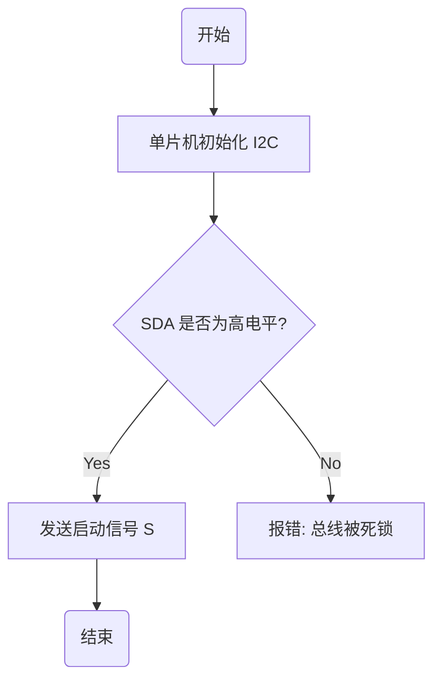
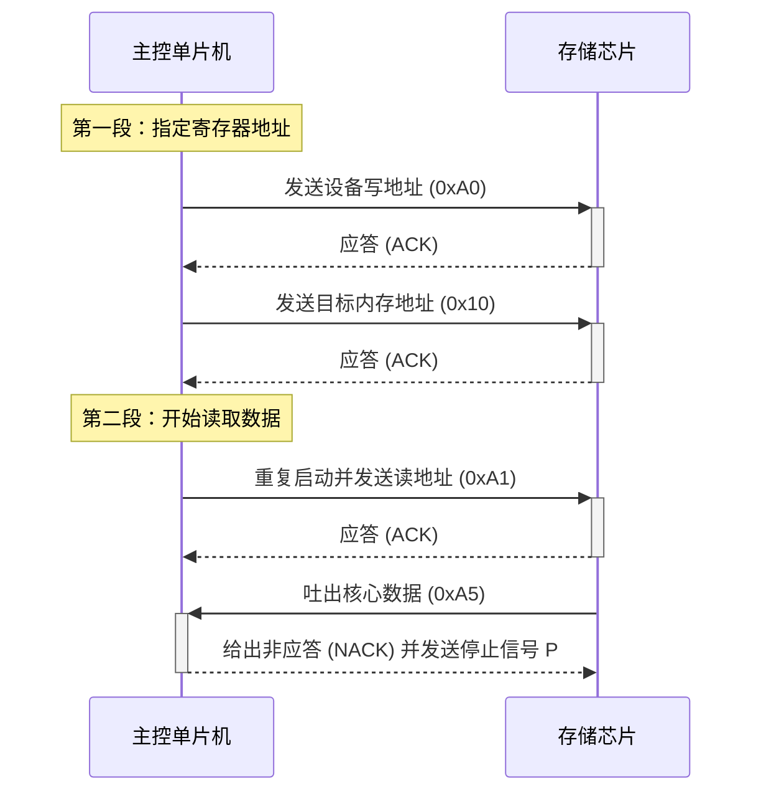

# 1 定义不同级别的标题

使用 # 定义一级标题（通常用于：整篇文档的大标题/书名）；## 定义二级标题（通常用于：大章节、第一部分）；### 定义三级标题（通常用于：章节下的小点、具体话题）；#### 定义四级标题（通常用于：更深一层的细分小点）

**注意，在#和标题文字中间要有一个空格，否则会把整体的内容当做普通文本，不会变大加粗**

# 2 给文字加粗

在需要加粗的文字两边加入**，这样就可以把对应的文字加粗。如果想加粗加斜体可以使用***，**加粗符号 ** 必须在一行内紧紧包裹住你想加粗的字**，及在**的两段不能空格或回车。

举例：**这是需要加粗的文本**

# 3 ---

---表示水平分割线，当你的文档从一个大话题跳到另一个毫不相关的话题时，用一行 --- 可以提醒读者“下面是全新的内容了”

注意事项：

**1.独占一行：**--- 必须自己单独呆在一行，前后都不能有其他文字。

**2.前后留空行：**
为了防止编译器误把 --- 识别为上面那一行的“大标题下划线”，最安全的写法是它的上一行和下一行都留出一个空行（按回车）。

# 4 代码块与语法高亮
在写单片机 C 语言代码或命令时，**用三个反引号** 包裹代码。在第一组反引号后面写上语言名称（如 c, python, bash），GitHub 就会自动为代码加上彩色高亮，并自带一键复制按钮。反引号在Tab的上边，在英文输入法中直接按就是反引号，加shift就是~

    ```c
    // 这是一个 I2C 写入示例
    uint8_t data = 0x50 << 1; 
    I2C_Write(data);
    ```
```c
// 这是一个 I2C 写入示例
uint8_t data = 0x50 << 1; 
I2C_Write(data);
```

# 5 行内代码块

使用一对反引号可以生成行内代码块，核心作用可以总结为一句话：**在视觉上给技术词汇“套上一层隔离保护壳”，让看笔记的人一眼就能抓到核心重点**

`这就是行内代码块的展示`

作用一：改变字体和背景，一眼看出“这是代码变量”

如果不加反引号，代码里的变量、函数名就会和普通汉字混在一起，阅读时极其费劲。

- **❌ 不加反引号的普通文本：**  
    当单片机收到数据时，如果start_condition函数返回1，则变量current_state的值会被修改为STATE_RUNNING。
- **加上反引号后的效果：**  
    当单片机收到数据时，如果 `start_condition` 函数返回 `1`，则变量 `current_state` 的值会被修改为 `STATE_RUNNING`。

**物理变化：** 加上反引号后，Markdown 编辑器会自动把里面的文字变成**等宽字体（Monospace）**，并且通常会套上一个**淡淡的灰色背景色框**。这样读者的眼睛就能瞬间在密密麻麻的文字中，精准捕捉到这些核心的代码符号。

作用二：防止符号被 Markdown “误伤”或错误排版（符号隔离）

C 语言和嵌入式开发中充满了各种奇奇怪怪的符号（比如指针的 `*`、按位与的 `&`、左移的 `<<`）。这些符号在 Markdown 里刚好也是语法控制符！如果不加反引号，你的笔记会彻底乱套。

- **❌ 不加反引号的惨剧：**  
    如果你想在笔记里写：我们在代码里要用到指针变量 *p_func 和 *p_reset。
    - **Markdown 误伤结果：** 它会把这两个星号当成“加粗”或“斜体”语法，导致你笔记里的字母突然变成了斜体，而星号本身**直接消失了**！
- **加上反引号的物理隔离：**  
    我们在代码里要用到指针变量 `*p_func` 和 `*p_reset`。
    - **结果：** 放在反引号内部的任何特殊符号，Markdown 都会**无条件放弃解析**，原封不动、极其安全地把它当成纯文本展示出来。

单个反引号是用来在句子中间“划重点、保护变量名”的；而三个反引号则是用来在句子外面“敲下一整段可以高亮显示的大代码块”的。

# 6 制作表格（Table）

用于对比参数（比如不同采样率、不同引脚功能）。用竖线 | 分隔列，第二行用减号 --- 划定表头。

| 引脚名称 | 物理通道 | 作用 |
| :--- | :---: | :--- |
| **SCL** | CH0 | 串行时钟线（时钟脉冲） |
| **SDA** | CH1 | 串行数据线（双向传输） |

```
| 引脚名称 | 物理通道 | 作用 |
| :--- | :---: | :--- |
| **SCL** | CH0 | 串行时钟线（时钟脉冲） |
| **SDA** | CH1 | 串行数据线（双向传输） |
```

注意：（里面的:要用英文格式的，否则会识别不出来）

**:---**
代表左对齐，

**:---:**
代表居中对齐

# 7 任务清单（Task List）

用于展示项目进度。使用 - [ ] 代表未完成，- [x] 代表已完成。在 GitHub 网页上，别人可以直接用鼠标勾选它们

- [x] I2C 硬件接线与共地
- [x] DSView 采样率与触发设置
- [ ] 编写 SPI 协议解码教程、

# 8 用代码画图（Mermaid语句）

用 三反引号 + mermaid 包裹文字，GitHub 就会自动把它渲染成极其漂亮的矢量图
## 8.1 流程图（Flowchart）

规则：**节点名称[节点形状与文字] --> 符号链接 --> 另一个节点**

1.规定大方向（第一行声明）在 三反引号 + mermaid 的第一行，必须写 graph 或 flowchart，紧接着写方向代号：TD 或 `TB：Top-Down / Top-Bottom（从上往下画）LR：Left-to-Right（从左往右画）`

2.控制节点的“形状”规则（用不同的括号包裹）如果不加括号（如 A），默认是一个没有边框的裸字。加上括号可以改变框的形状：

&emsp;矩形框（普通动作）：用方括号 A[文字]
 
&emsp;圆角矩形（开始/结束）：用圆括号 A(文字)
  
&emsp;菱形框（条件判断）：用尖括号/菱形括号 A{文字}
  
&emsp;圆形（状态节点）：用双重圆括号 A((文字))
 
3.线条与箭头的链接

&emsp;规则普通带箭头线条：A --> B
    
&emsp;不带箭头的粗线：A --- B
    
&emsp;虚线带箭头：A -.-> 
    
&emsp;B加粗线条带箭头：A ==> 
    
&emsp;B在线条上加文字（最常用）：A -- 文字 --> B 或 A -->|文字| B

    ```mermaid
    graph TD
        Start(开始) --> Init[单片机初始化 I2C]
        Init --> Check{SDA 是否为高电平?}
        Check -- Yes --> SendStart[发送启动信号 S]
        Check -- No --> Error[报错: 总线被死锁]
        SendStart --> End(结束)
    ```
    

渲染效果：网页上会自动生成一个带有判断框（{ }）和矩形框（[ ]）的流程图，且支持自动排版（TD 代表从上往下，改成 LR 就变成从左往右）。

## 8.2 时序图（Sequence Diagram）
时序图（循序图）用来表达多个硬件或模块之间，随着时间先后顺序发生的信号交互

规则：

1. 声明与参与者（第一、二行）
  
> 第一行固定写：sequenceDiagram

> 声明有谁参与（可选）：participant 主控，participant 从机。(如果不声明，系统会按照你代码里第一次出现的顺序从左往右排队)。

2. 箭头规则（控制动作的线条样式）

   时序图的灵魂在于箭头的形状，它代表了不同类型的信号通知：
   
   实线实心箭头（发出的同步指令）：A ->> B: 文字

   虚线实心箭头（返回的回复/应答）：B -->> A: 文字 （I2C 的 ACK 极其适合用这个）

   实线无箭头（纯打招呼）：A -> B: 文字

   虚线无箭头：A --> B: 文字

   实线末端带叉（代表异步/连接断开）：A -x B: 文字

3. 激活状态高亮（Active/Deactive）

   用来表现某个芯片正在“疯狂干活处理数据”的状态。在时间轴上会显示一个长条矩形：

   开始干活：activate 从机（或者在箭头后面直接加个 + 号，如 A ->>+ B: 呼叫）

   干完活了：deactivate 从机（或者在箭头后面加个 - 号）

4. 注释框规则（Note）

   在时间轴旁边贴一个小便签做补充说明：

   语法：Note over 谁: 提示文字（或者 Note left of 谁、Note right of 谁）

        ```mermaid
        sequenceDiagram
            participant MCU as 主控单片机
            participant EEPROM as 存储芯片
            
            Note over MCU: 第一段：指定寄存器地址
            MCU ->>+ EEPROM: 发送设备写地址 (0xA0)
            EEPROM -->>- MCU: 应答 (ACK)
            MCU ->>+ EEPROM: 发送目标内存地址 (0x10)
            EEPROM -->>- MCU: 应答 (ACK)
            
            Note over MCU: 第二段：开始读取数据
            MCU ->>+ EEPROM: 重复启动并发送读地址 (0xA1)
            EEPROM -->>- MCU: 应答 (ACK)
            EEPROM ->>+ MCU: 吐出核心数据 (0xA5)
            MCU -->>- EEPROM: 给出非应答 (NACK) 并发送停止信号 P
        ```



# 9 段前缩进

1.在每段的前面加入 **&emsp；** 达到当前段落的缩进效果，注意用英文格式的符号

2.在每段的前面加入 > 达到缩进效果，**需要注意在> 后面有一个空格**，使用之后会在左边生成一个竖线


